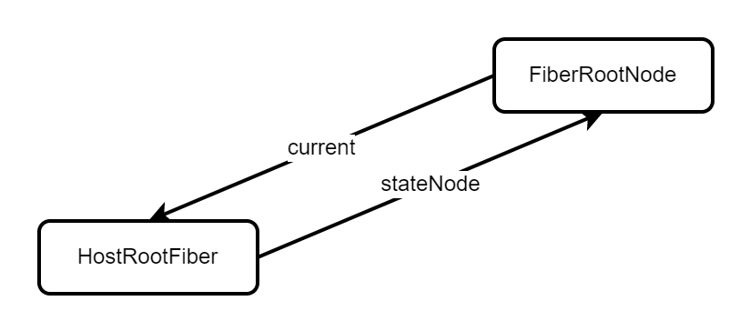
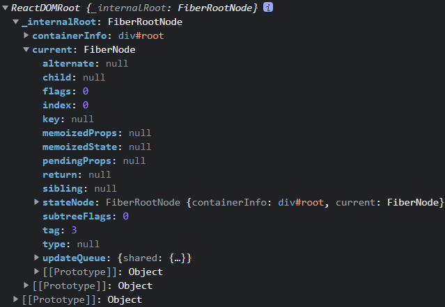

## 创建根节点流程
#### 入口函数：
1. 首先会进入创建根容器的流程
2. 创建ReactDOMRoot实例
3. ReactDOMRoot实例添加render方法

```javascript
const root = createRoot(document.querySelector('#root'));

export function createRoot(container) {
    const root = createContainer(container);
    return new ReactDOMRoot(root);
}

function ReactDOMRoot(internalRoot) {
    // FiberRootNode实例
    this._internalRoot = internalRoot;
}

// 渲染组件
ReactDOMRoot.prototype.render = function (children) {
    const root = this._internalRoot;
    root.containerInfo.innerHTML = '';
    updateContainer(children, root);
};
```
#### 创建容器：createContainer → createFiberRoot
1. 创建FiberRootNode实例
2. 创建HostRootFiber节点
3. 将FiberRootNode与HostRootFiber关联
   
4. 初始化更新队列
> 上述的详细的流程看后续，
```javascript
export function createFiberRoot(containerInfo) {
  // 创建FiberRootNode实例
  const root = new FiberRootNode(containerInfo);
  // 创建根fiber节点
  const uninitializedFiber = createHostRootFiber();
  // 根节点的current指向根fiber
  root.current = uninitializedFiber;
  // 根fiber的stateNode指向根节点（真实DOM）
  uninitializedFiber.stateNode = root;
  initialUpdateQueue(uninitializedFiber);
  // 返回FiberRootNode实例
  return root;
}
```
##### 创建FiberRootNode实例
1. containerInfo指向真是DOM节点
```javascript
function FiberRootNode(containerInfo) {
  this.containerInfo = containerInfo;
}
```

#### 创建根fiber
```javascript
function createFiber(tag, pendingProps, key) {
    return new FiberNode(tag, pendingProps, key);
}

// 每种虚拟DOM都会有自己Fiber Tag类型
function FiberNode(tag, pendingProps, key) {
    this.tag = tag; // fiber的类型：根元素 - 3，函数组件 - 0
    this.key = key; // 唯一标识
    this.type = null; //Fiber类型，来自于虚拟DOM的type - div、span...
    this.stateNode = null; //此fiber对应的真实DOM节点

    this.return = null; // 指向父节点
    this.child = null; // 指向子节点
    this.sibling = null; // 指向下一个兄弟节点
    // 虚拟DOM提供pendingProps用来创建fiber节点的属性
    this.pendingProps = pendingProps; // 等待生效的属性
    this.memoizedProps = null; // 已经生效的属性

    // 每个fiber节点都有自己的状态，每种状态fiber状态存的类型是不一样的
    // 类的fiber存的是类的实例状态，hostRoot存的是要渲染的元素
    this.memoizedState = null;
    this.updateQueue = null; // fiber的更新队列

    // 副作用标识
    this.flags = NoFlags;
    // 子节点的副作用标识
    this.subtreeFlags = NoFlags;
    // 双缓存的替身
    this.alternate = null;

    this.index = 0;
}
```
#### 初始化更新队列
```javascript
export function initialUpdateQueue(fiber) {
  const queue = {
    shared: {
      // 指向最新的update
      pending: null,
    },
  };
  fiber.updateQueue = queue;
}
```
#### 最后得到的root实例


