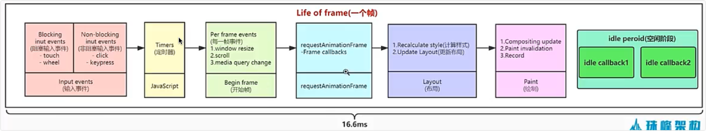
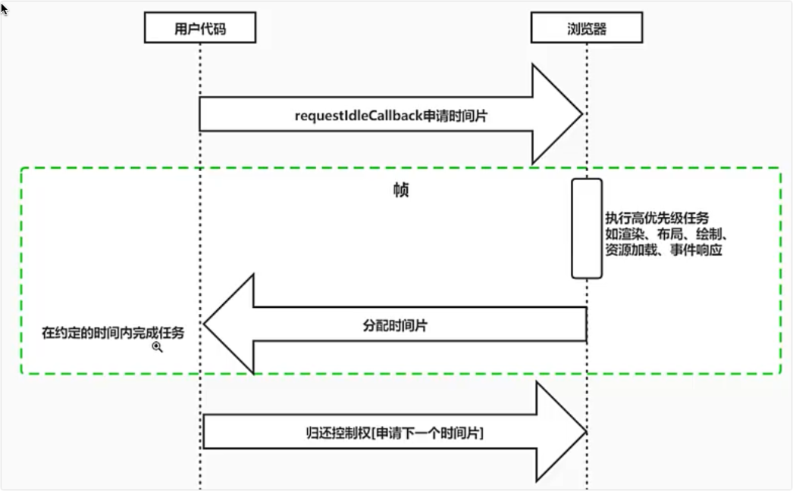
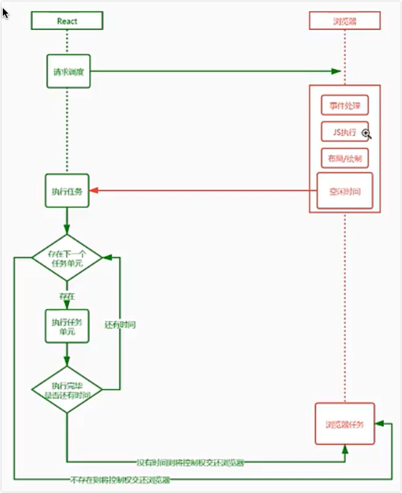
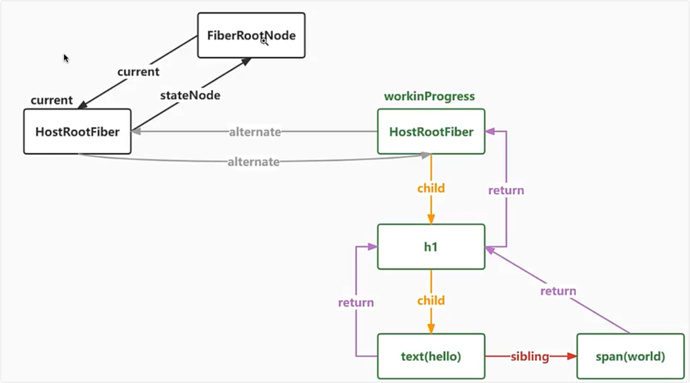
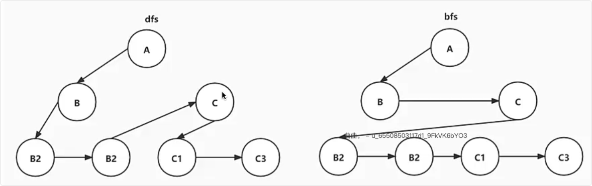
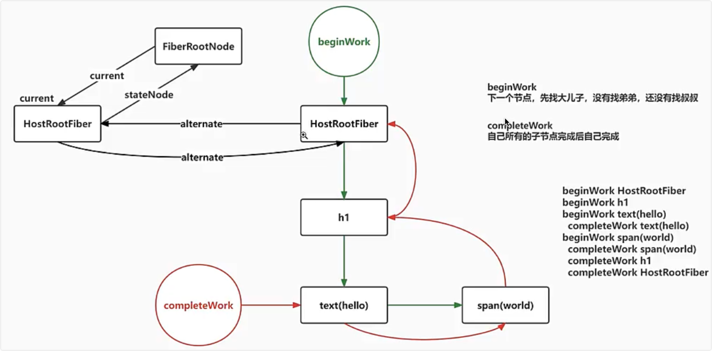

# fiber

1. 把一个耗时的任务切分成一个个小任务

## 桢

1. 每桢

- fiber 是一个执行单元

  - 每次执行完一个单元，react就会检查现在还剩多少时间，如果没有时间就将控制权让出去
    

- fiber是一种数据结构

  - react使用链表存储的fiber，每个虚拟节点内部表示为一个fiber
  - b. 从定点开始遍历
  - 如果有儿子，先遍历第一个儿子
  - 如果没有第一个儿子，标志着此节点遍历完成
  - 如果有弟弟节点，则遍历弟弟节点
  - 如果没有下一个弟弟，返回父节点标识完成父节点遍历，如果有叔叔节点遍历叔叔
  - 没有父节点遍历结束

  

  - child 指向第一个子节点
  - sibling 指向弟弟节点
  - return 指向父节点
  - alternate 双缓存使用
  - current 指向渲染好的根Fiber
  - stateNode 指向根的真实DOM
  - 如果只有一个子节点，且子节点使文本节点，则不会创建对应fiber节点

## 深度优先遍历

## 遍历fiber

- beginWork “递”的过程
- completeWork “归”的过程

  

  - react执行分为两个节点
    - 第一个阶段render计算副作用
    - 第二个阶段commit修改真实DOM
