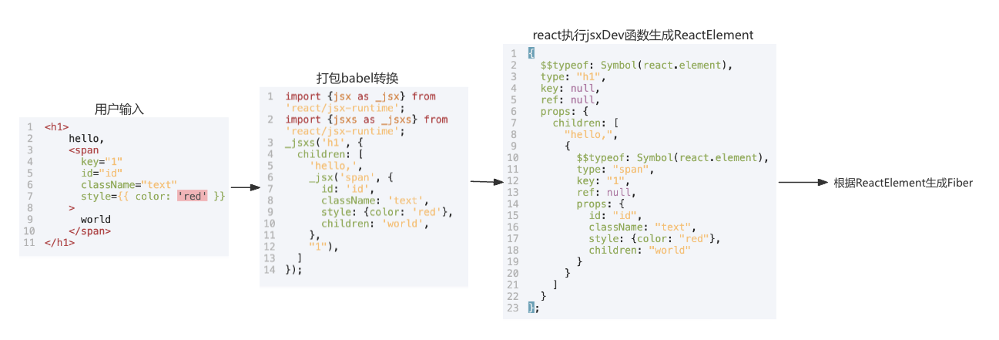
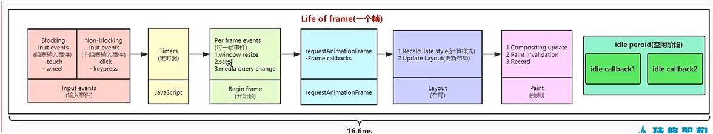

# jsx

- 在开发环境，@vitejs/plugin-react-swc插件在遇到jsx语法后会自动调用jsxDEV方法去解析jsx。
- jsxDEV方法需要定义在react/src/jsx/ReactJSXElement.js文件中

## 流程

1. 用户编写jsx
2. 打包时babel调用jsxDEV
3. 浏览器执行jsxDEV方法将jsx转义为ReactElement,
4. 根据ReactElement生成Fiber(虚拟DOM)
5. 展现给用户真实的DOM元素

## 虚拟DOM

内存中的一个js对象，用来描述真实DOM。

## 帧

