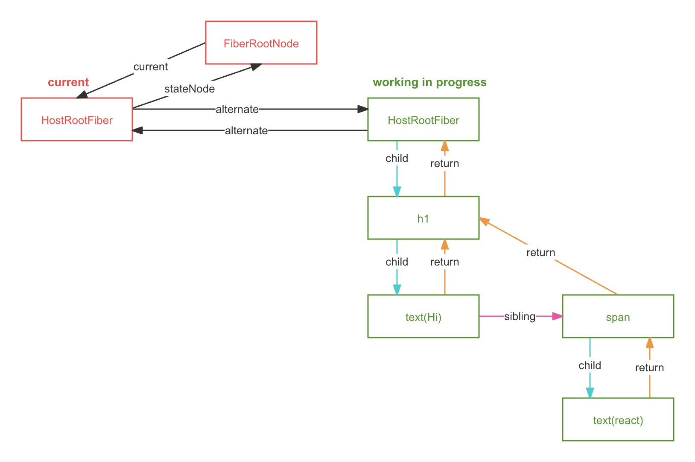

# fiber

- 通过fiber架构，使调和的过程可被中断，适时让出CPU的执行权，可以让浏览器及时的响应用户的交互

## fiber是一个执行单元

- fiber是一个执行单元，每次执行完一个执行单元，react就会检查现在还剩多少时间，如果没有时间就让出控制权

## fiber是一种数据结构

- React 使用链表作为fiber的数据结构，每个虚拟节点表示一个fiber
- 从定点开始遍历
- 有子fiber先遍历子fiber
- 没有子fiber， 标志该节点遍历完成
- 如果有兄弟节点则遍历兄弟节点
- 没有兄弟节点，返回父节点表示完成父节点的遍历
- 没有父节点遍历结束

## react执行的两个阶段

### render

- 计算副作用

### commit

- 修改真实DOM
