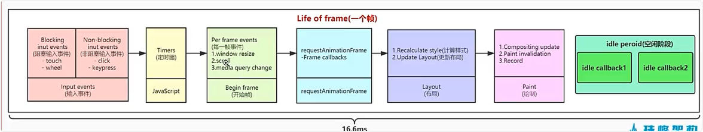

# jsxDEV

- 在开发环境,@vitejs/plugin-react插件在遇到jsx语法后会自动调用jsxDEV方法去解析jsx
- 会调用react/jsx-dev-runtime.js文件
- jsxDEV方法定义在react/src/jsx/ReactJSXElement.js文件中

## 流程

> 用户编写jsx -> 打包的时候babel转义(jsxDEV)成ReactElement -> 浏览器运行 ReactElement 生成Fiber(虚拟DOM) ->展现给用户 真实的DOM元素

